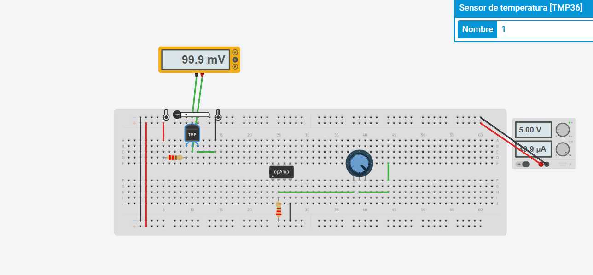
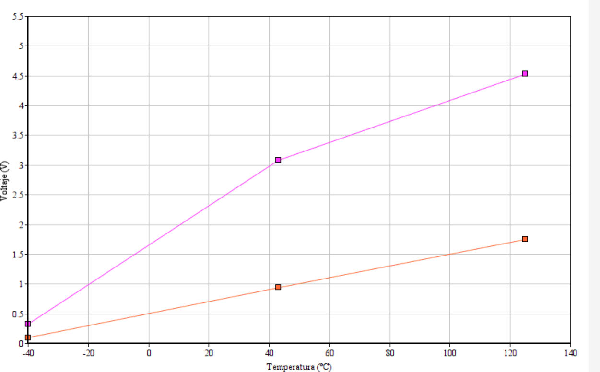
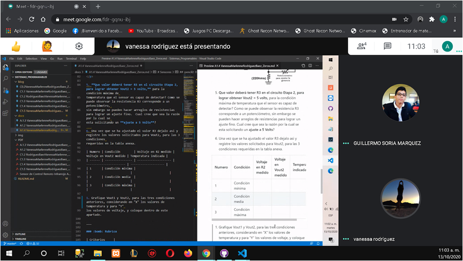
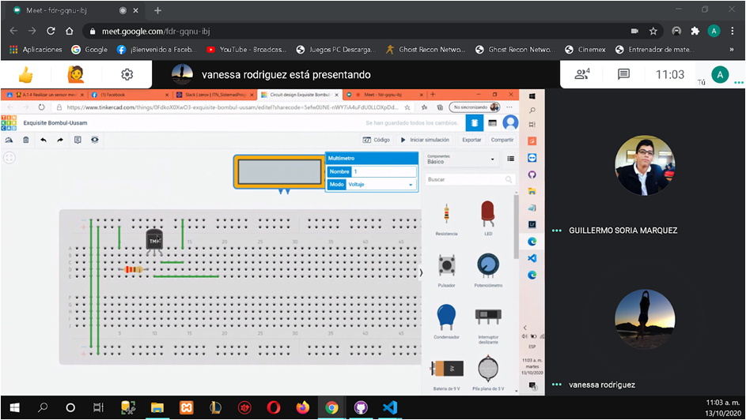
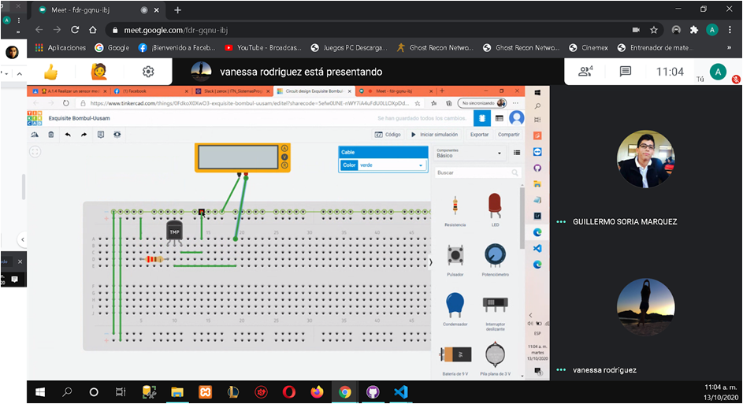
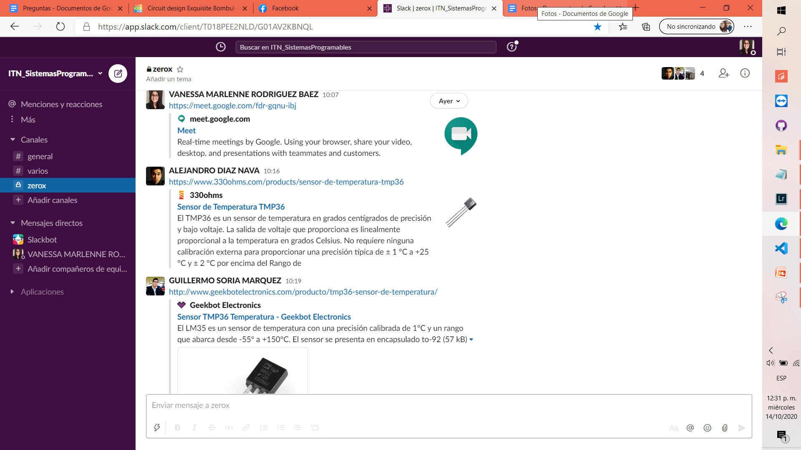
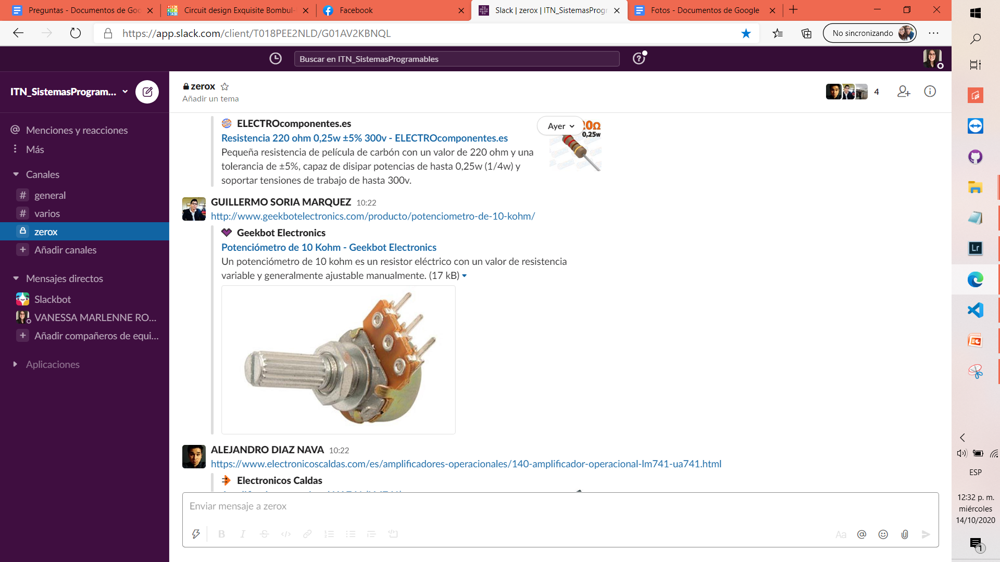
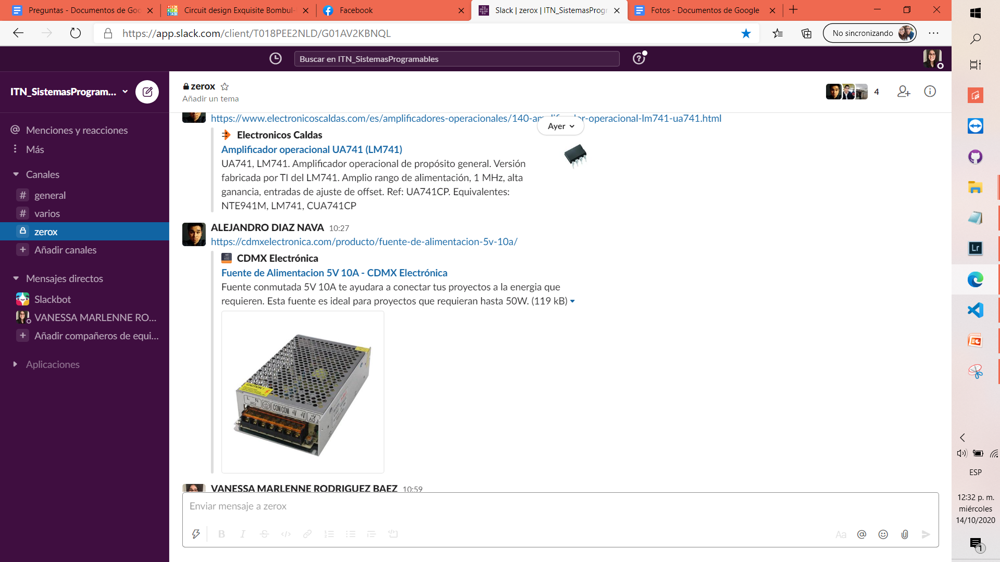

# Sensores

## :trophy: A.1.4 Actividad de aprendizaje

## Objetivo

Realizar un sensor medidor de temperatura a través de un circuito electrónico, utilizando un simulador, y  un **Transistor 
TMP36** lineal de temperatura y un **amplificador operacional LM741**.

## :blue_book: Instrucciones

- Se sugiere para el desarrollado de la presenta actividad, utilice uno de los siguientes simuladores: [Autodesk Tinkercad](https://www.tinkercad.com/), [Virtual BreadBoard](http://www.virtualbreadboard.com/), [Easy EDA](https://easyeda.com/) por 
lo cual habrá que familiarizarse antes, e incluso instalarse o registrarse dentro de la plataforma.
- Toda actividad o reto se deberá realizar utilizando el estilo **MarkDown con extension .md** y el entorno de desarrollo 
VSCode, debiendo ser elaborado como un documento **single page**, es decir si el documento cuanta con imágenes, enlaces o 
cualquier documento externo debe ser accedido desde etiquetas y enlaces, y debe ser nombrado con la nomenclatura **A1.
4_NombreApellido_Equipo.pdf.**
- Es requisito que el .md contenga una etiqueta del enlace al repositorio de su documento en GITHUB, por ejemplo **Enlace a 
mi GitHub** y al concluir el reto se deberá subir a github.
- Desde el archivo **.md** exporte un archivo **.pdf** que deberá subirse a classroom dentro de su apartado 
correspondiente, sirviendo como evidencia de su entrega, ya que siendo la plataforma **oficial** aquí se recibirá la 
calificación de su actividad.
- Considerando que el archivo .PDF, el cual fue obtenido desde archivo .MD, ambos deben ser idénticos.
- Su repositorio ademas de que debe contar con un archivo **readme**.md dentro de su directorio raíz, con la información 
como datos del estudiante, equipo de trabajo, materia, carrera, datos del asesor, e incluso logotipo o imágenes, debe tener 
un apartado de contenidos o indice, los cuales realmente son ligas o **enlaces a sus documentos .md**, _evite utilizar 
texto_ para indicar enlaces internos o externo.
- Se propone una estructura tal como esta indicada abajo, sin embargo puede utilizarse cualquier otra que le apoye para 
organizar su repositorio.
  
```
- readme.md
  - blog
    - C0.1_x.md
    - C0.2_x.md
  - img
  - docs
    - A0.1_x.md
    - A0.2_x.md
    - A1.2_x.md
    - A1.3_x.md
```

## :pencil2: Desarrollo

1. Utilice el siguiente listado de materiales para la elaboración de la actividad

    | Cantidad | Descripción                       | Fuente de consulta |
    | -------- | --------------------------------- | ------------------ |
    | 1        | Sensor temperatura TMP36          |[Geekbot Electronics](http://www.geekbotelectronics.com/productotmp36-sensor-de-temperatura/)                   |
    | 1        | Potenciómetro 10k                 | [Geekbot Electronics](http://www.geekbotelectronics.com/producto/potenciometro-de-10-kohm/)                   |
    | 2        | Resistencias de 220               | [Electro Componentes](https://www.electrocomponentes.es/resistencias/resistencia-220-ohm-025w-32-.html)                   |
    | 1        | Amplificador LM741                | [Electronicos Caldas](https://www.electronicoscaldas.com/es/amplificadores-operacionales/140-amplificador-operacional-lm741-ua741.html)                   |
    | 1        | Fuente de alimentación de 5Volts. |[CDMX Electronica](https://cdmxelectronica.com/producto/fuente-de-alimentacion-5v-10a/)                 |

    Para mayor información acceder a los siguientes enlaces:

    - Información y especificaciones del [Sensor TMP36](https://components101.com/sites/default/files/component_pin/TMP36-Sensor-Pinout.png)  
    - Información y especificaciones del [Amplificador operacional LM741](https://ortegamraul.files.wordpress.com/2014/03/741-interno.png)

2. Basado en la imagen ensamble mediante un simulador el circuito electrónico etapa 1, colocando el transistor LM35 en la 
posición indicada. 

<p align="center">
    
</p>


3. Calcule, mida y registre los valores solicitados para Vout1, bajos las 3 condiciones requeridas en la tabla anexa.

| Numero | Condición | Voltaje Vout1 medido | Voltaje en R1 medido | Temperatura indicada |
| ------ | --------- | -------------------- | -------------------- | -------------------- |
| 1      | Mínima    |    99.9mV                  |  11mV                    |      -40°C                |
| 2      | Media     |    939mV                  |   11mV                   |       43°C                |
| 3      | Máxima    |    1.75V                  |   11mV                   |       125°C               |

4. Utilizando la imagen del transistor TMP36 que corresponde a la etapa 1, conecte la terminal Vout1 a la terminal no 
inversora del LM741, y ensamble el circuito correspondiente a la etapa 2.

<p align="center">
    

</p>


5. **Que valor deberá tener R3 en el circuito Etapa 2, para lograr obtener Vout2 = 5 volts,** para la condición máxima de 
temperatura que el sensor es capaz de detectar? Como se puede observar la resistencia R3 corresponde a un potenciómetro, 
sin embargo se pueden hacer arreglos de resistencias para lograr un ajuste fino.  Cual cree que sea la razón por la cual se 
esta solicitando un **ajuste a 5 Volts**?

* El valor que nosotros le dimos a R3 es de 500 ohms ya que si le poniamos mas valor no se podía variar cuando subia o bajaba la temperatura.
* El ajuste de 5V pensamos que es por que el sensor y el integrado no soporta mas voltaje y se podría quemar fácilmente.
6. Una vez que se ha ajustado el valor R3 dejalo asi y registre los valores solicitados para Vout2, para las 3 condiciones. 
requeridas en la tabla anexa.

| Numero | Condición        | Voltaje en R2 medido | Voltaje en Vout2 medido | Temperatura indicada |
| ------ | ---------------- | -------------------- | ----------------------- | -------------------- |
| 1      | Condición mínima |      99.9mV                |   327mv                      |  -40°C                     |
| 2      | Condición media  |      939mV                |   3.08V                      |  43°C                      |
| 3      | Condición máxima |       1.38v               |   4.53V                      |   125°C                     |

7. Grafique Vout1 y Vout2, para las tres condiciones anteriores, considerando en "X" los valores de temperatura y para "Y" 
los valores de voltaje, y coloque dentro de este apartado.


8.Conclusiones


   **Diaz Navarro Alejandro**
   Con la realización de esta practica obtuve los conocimientos sobre el funcionamiento y comportamiento que tiene el sensor de temperatura TMP36 y como este va variando el voltaje dependiendo la temperatura que mide, un dato curioso fue ver que al medir el voltaje este no variaba en la resistencia ya que al parecer el sensor requería mas energía para funcionar, y esto provocaba que diera medidas un poco bajas y sin cambio, ya en la etapa 2, fue un poco complicado al momento de agregar los otros dos componentes y saber poner el valor adecuado en el amplificador, para al momento de variar la temperatura los valores que se miden estos fueran cambiando al momento de estar moviendo la temperatura en el sensor.


* **Rodríguez Báez Vanessa Marlenne**

  Los sensores son parte de nuestra vida acutualmente ya que nos ayudan en proyectos que antes era súper difícil completar o era mas tedioso, en esta practica se aprendio el como funciona el sensor de temperatura y el aplificador y como en toda practica tuvimos unos problemas al momento de querer encontrar el valor de R3 para quenos diera los 5 volts al medirlo lo cual nos fuimos primero por valores comenciales pero solo marcava los 5v y no habia variacion si bajaba la temperatura lo que realizamos para solucionarlo fue sacar el valor que tendria R3 y al colocarlo en el simuladro nos dimos cuenta que si le poniamos un valor de 500 ohms ya variaba los valores y con esos valores realiamos nuestra grafica correspondiente, En esta practica aprendi el uso tambien del potenciometro.


* **Soria Marquez Guillermo**

  En esta practica aprendi el funcionamiento del sensor Sensor TMP36 y el Amplificador operacional LM741. La practica consiste en 2 partes, para la parte 1 tuvimos problemas ya que al medir la temperatura y los "mv" en distintas ocasiones nos salian valores diferentes, esto era porque tuvimos una falla en el circuito, ubicamos la falla y lo solucionamos. En la parte 2 era poner un valor en R3 , estuvimos probando variosvalores pero al final pusimos 500 ohms ya que si le poniamos mas valor no se podía variar cuando subia o bajaba la temperatura. 

 9.Evidencias 









___

### :bomb: Rubrica

| Criterios     | Descripción                                                                                  | Puntaje |
| ------------- | -------------------------------------------------------------------------------------------- | ------- |
| Instrucciones | Se cumple con cada uno de los puntos indicados dentro del apartado Instrucciones?            | 10      |
| Desarrollo    | Se respondió a cada uno de los puntos solicitados dentro del desarrollo de la actividad?     | 60      |
| Demostración  | El alumno se presenta durante la explicación de la funcionalidad de la actividad?            | 20      |
| Conclusiones  | Se incluye una opinión personal de la actividad  por cada uno de los integrantes del equipo? | 10      |

:house: [Link  Díaz Navarro Alejandro](https://github.com/AlejandroDiaz96/SistemasProgramables2020)

:house: [Link Rodríguez Báez Vanessa Marlenne](https://github.com/vanessamRodriguez/Sistemas_Programables)


:house: [Link Soria Márquez Guillermo](https://github.com/GuillermoSoria97/Sistemas_P)


